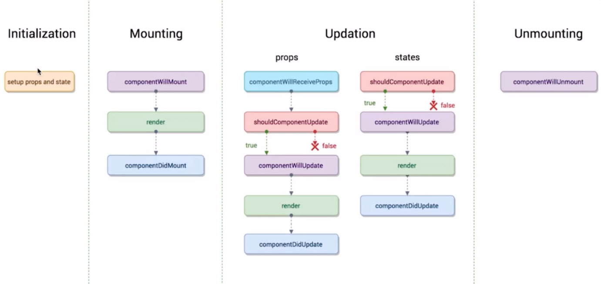

# 视图

## 页面

> QAP 应用使用开源的 Rax 渲染引擎渲染页面，Rax 语法 + 生命周期，以下简要介绍 Rax 与相关语法。

[Rax开源地址](https://alibaba.github.io/rax/guide)

### 页面与组件

- 一个页面就是一个组件
- 一个页面里嵌套的每一极标签，都可以理解为一个子组件
- 页面是由一层一层组件构成
- 对于页面内的子组件尽可能采用无状态组件（UI组件）

```html
import { createElement, render, Component } from 'rax';
import {Text} from 'nuke';

class Demo extends Component {
  render() {
    return <Text>Hi QAP~</Text>;
  }
}

render(<Demo />);
```
render(<Demo /> 是将 <Demo /> 这个组件渲染到了客户端容器的根节点，此时我们称<Demo />为一个页面，或者一个根组件。

### 模板语法
- 通过state绑定页面数据展现

```html
import {createElement, Component,render} from 'rax';
import { Text} from 'nuke';

class TextDemo extends Component {
    constructor() {
        super();
        this.state = {
            num: 0
        }
    }
    render(){
        return (
            <Text style={styles.container}>{this.state.num}</Text>
        )
    }
}
```
this.state获取数据尽量使用结构赋值

```html
render(){
        const {num}=this.state;
        return (
            <Text style={styles.container}>{num}</Text>
        )
    } 
```

- 数组遍历输出
	- return 的里每一个item必须加上key值，可以是index，建议使用item，这样可以优化提高diff算法

```
{
    this.state.imageList.map((item,index)=>{
        return (<Image key={item} style={styles.pic} source={{ uri : item.url }}></Image>)
     })
}
```

- 条件渲染

```
import {createElement, Component,render} from 'rax';
import {View, ListView} from 'nuke';

class ListViewDemo extends Component {
    constructor() {
        super();
        this.state = {
            loaded: false
        }
    }
    render(){
        const {loaded } = this.state;
        return (
            <View style={styles.container}>
            {
                loaded ?
                <ListView
                    renderRow={this.renderItem}
                    dataSource={this.state.imgList} style={styles.list}
                />
                : null
            }  
            </View>
        )
    }
}
```

## 组件生命周期

Rax与React语法相近，生命周期相同，组件免不了要与用户互动，React 的一大创新，就是将组件看成是一个状态机，一开始有一个初始状态，然后用户互动，导致状态变化，从而触发重新渲染 UI。

组件的生命周期大致可以分为：创建、变化、销毁

生命周期枚举：

- 组件即将加载: componentWillMount
- 组件已加载: componentDidMount
- 组件即将接收新的props: componentWillReceiveProps
- 组件是否要更新: shouldComponentUpdate
- 组件即将更新: componentWillUpdate
- 组件已更新: componentDidUpdate
- 组件即将卸载: componentWillUnmount


[课外延伸]



- initialization 初始化
- Mounting 挂载
- Updation  组件更新
- Unmounting  组件卸载

## 开发一个组件

以 MyButton 为例,在项目中创建 qap/src/components/MyButton/index.jsx

```
import { createElement, Component,render } from 'rax';
import { Touchable ,Text } from 'nuke';

class MyButton extends Component {
   constructor(props){
        super(props);
    }
    render() {
    	const {text, onPress } = this.props;
       return (
        	<Touchable style={{...}} onPress={(e)=>{onPress && onPress(e) }}>
            	<Text>{text}</Text>
        	</Touchable>
        );
    }
}
render(<MyButton />);
```

## 使用MyButton组件

在首页使用，打开 qap/src/pages/index/index.jsx

```
/* @jsx createElement */
import { createElement, Component,render } from 'rax';
import MyButton from '../../components/MyButton';
import { View,Text, Modal} from 'nuke';

class Index extends Component{
    pressEvent = (e) => {
        Modal.alert('hello QAP');
    }
    render(){
        return (<View>
           <Text>...其他部分省略</Text>
           	<MyButton onPress={this.pressEvent}>请点我</MyButton>
        </View>
        );
    }
}

render(<Index />);
```


## 样式

样式书写在对应组件或页面内

#### 基本单位 ：rem

rem 单位与原来传统的 rem 的含义是不同的。

`1rem = 设备宽度（最短边） / 750`

如我们推荐视觉稿产出宽度为750px，在这样的前提下，**我们在 750 的设计稿上量到的数值是100，那么 width : 100 rem 就是我们需要映射到元素上的尺寸**。

```
const styles={
    button:{
        width:'100rem',
        height:80  // 缩写， 可以不写 rem , 直接写 number 类型。
    }
}
```

### 非标准伪类展示按下态
你可以使用 `:active` 伪类来定义你的组件 `press` 时的样式。

```
<View style={{height:'300rem',backgroundColor:'#3089dc','backgroundColor:active':'#cccccc'}}>
    <Text style={{color:'#ffffff'}}>普通使用</Text>
</View>
```

请注意以上伪类写法与 h5 端不同。

你也可以使用封装过后的 Touchable 组件的 activeStyle 定义伪类

### 一些特点：

- 样式的**属性名必须采用驼峰命名规范**，如：`borderWidth: '0rem', borderTopWidth: '2rem', borderColor: '#e2e3e8'`
*  一般情况下样式属性**不能被继承，没有全局样式的概念，没有样式层叠的概念**
*  页面布局仅仅支持Flexbox布局，**没有流式布局、响应式布局的概念**
	
* 可以使用js 数组完成样式的叠加

```
<View style={[styles.container,styles.new,{backgroundColor:'yellow'}]}>
  <Text>hello world</Text>
</View>

const styles = {
  container: {
    backgroundColor: 'grey',
    width: '750rem'
  },
  new:{
  	borderWidth:'1rem',
  	borderStyle:'solid',
  	borderColor:'#ffffff'
  }
};
```
### Flex布局
* [Flex 布局教程](http://www.ruanyifeng.com/blog/2015/07/flex-grammar.html)

Flex 是 Flexible Box 的缩写，意为“弹性布局”，用来为盒状模型提供最大的灵活性。元素排列默认主轴为水平方向，起点在左端。项目都排在一条线，默认不换行。

子元素在父节点内的水平对齐方式 - 居左(start)、居中(center)、居右(end)、等宽排列(between)排列。子元素与子元素之间，支持顶部对齐(start)、垂直居中对齐(center)、底部对齐的方式(end)。

Flex.Item 组件默认加上了样式flex:1,保证所有 item 平均分宽度, Flex 容器的 children 不一定是 Flex.Item


### Native 样式枚举
Native 支持的样式属性有限，和 web 的 css 属性名称与含义存在一小部分交集

属性 | 说明
:--- | :---:
width | 不支持100% 百分比
height	| 不支持100% 百分比
boxSizing	| 不需要写，默认盒模型border-box
padding	|	不支持空格分割4个方向的格式，如需单独设置，请分开写
paddingLeft	|	
paddingRight	|	
paddingTop	|	
paddingBottom	|
margin	| 不支持空格分割4个方向的格式，如需单独设置，请分开写
marginLeft	| 
marginRight		| 
marginTop		| 
marginBottom		| 
borderStyle		| 不支持空格分割4个方向的格式，如需单独设置，请分开写
borderLeftStyle	| 	
borderTopStyle	| 	
borderRightStyle		| 
borderBottomStyle	| 	
borderWidth	| 	不支持空格分割4个方向的格式，如需单独设置，请分开写
borderLeftWidth	| 	
borderTopWidth	| 	
borderRightWidth		| 
borderBottomWidth	| 	
borderColor	| 	不支持空格分割4个方向的格式，如需单独设置，请分开写
borderLeftColor	| 	
borderTopColor	| 	
borderRightColor		| 
borderBottomColor	| 	
borderRadius	| 	不支持空格分割4个方向的格式，如需单独设置，请分开写。目前在 <image> 和 <text> 组件上尚无法只定义一个或几个角的 borderRadius。比如你无法在这两个组件上使用 borderTopLeftRadius。
borderBottomLeftRadius	| 	
borderBottomRightRadius		| 
borderTopLeftRadius		| 
borderTopRightRadius	| 	
display	| 	不需要写，默认flex。不支持none block inlineBlock 等
visibility	| 	hidden visible
flexDirection		| 
justifyContent		| 
alignItems		| 
position	| 	absoulte sticky fixed
top		| 
bottom		| 
left		| 
right	| 	
zIndex		| 不支持
overflow	| 	visible在安卓端不生效
color		| 支持 `rgb(255, 0, 0) rgba(255, 0, 0, 0.5) #ff0000 red 注意：不支持 #fff 这种简写形式
lines	| 	{number}类型， 指定文本行数。默认 0， 代表不限制行数。需配合text-overflow才能生效, h5端不生效
fontSize	| 	
fontStyle		| 可选值 normal italic，默认为 normal。
fontWeight	| 	字体粗细程度，可选 normal, bold, 400,700。normal= 400, bold = 700； 默认 normal。**不支持 lighter, bolder 这样的值**。ios 端额外支持 100~900 精细控制
textDecoration	| 	可选值 none underline line-through，默认值为 none。
textAlign		| 可选值 left center right，默认值为 left。暂不支持 justify, justify-all
textOverflow		| 可选值clip ellipsis


## 事件

### onPress点击事件

当组件上发生点击手势时被触发。

事件对象：

- type: click
- target: 触发点击事件的目标组件
- timestamp: 触发点击事件时的时间戳

`<Button onPress={(e) => console.log(e)} type="primary"> onPress 事件</Button>`

### onLongPress 长按事件
注意：onLongPress h5 暂不支持

当用户长按某个组件时，该事件将会被触发，View、Touchable 、Button 等容器级组件具备

事件对象：

- type : longpress
- target : 触发长按事件的目标组件
- timestamp : 长按事件触发时的时间戳

`<Button onLongpress={(e) => console.log(e)} type="primary"> onPress 事件</Button>`

### onAppear
如果一个在可滚动区域内的组件在屏幕上可见时，该事件将被触发，与 onDisappear 事件交替触发（在页面内可被多次触发）。

事件对象：

- type : appear
- target : 触发 Appear 事件的组件对象
- timestamp : 事件被触发时的时间戳
- direction : 触发事件时屏幕的滚动方向，up 或 down

`<View onAppear={(e) => console.log(e)}></View>`

### onDisappear
如果一个在可滚动区域内的组件滑出屏幕变为不可见状态时，该事件将被触发，与 onAppear 事件交替触发（在页面内可被多次触发）。

事件对象：

- type : disappear
- target : 触发 Disappear 事件的组件对象
- timestamp : 事件被触发时的时间戳
- direction : 触发事件时屏幕的滚动方向，up 或 down

`<View onDisappear ={(e) => console.log(e)}></View>`

### onScroll
ScrollView 在滚动时触发。

事件对象：

- type : scroll
- target : 触发 Scroll 事件的组件对象
- timestamp : 事件被触发时的时间戳
- contentOffset : 内容区位移 {x: 0, y: -100}
- contentSize : 内容区域尺寸 { height:1320.048, width:750}

`<ScrollView onScroll ={(e) => console.log(e)}></ScrollView>`

### onLoad
Image 组件完成加载时触发。

事件对象：

- type : load
- target : 触发 Load 事件的组件对象
- timestamp : 事件被触发时的时间戳
- success : 图片是否加载成功
- size : 图片实际尺寸 { naturalWidth:520, naturalHeight:280}

`<Image source={{uri:'http://img.alicdn.com/tps/TB1SrmcOVXXXXXFXpXXXXXXXXXX-520-280.jpg'}} onLoad ={(e) => console.log(e)}></Image>`

### onInput, onFocus, onBlur, onChange 等输入事件
见 Input 组件文档

### onChange
见 Slider 组件文档

### onValueChange
见 Switch 组件文档
